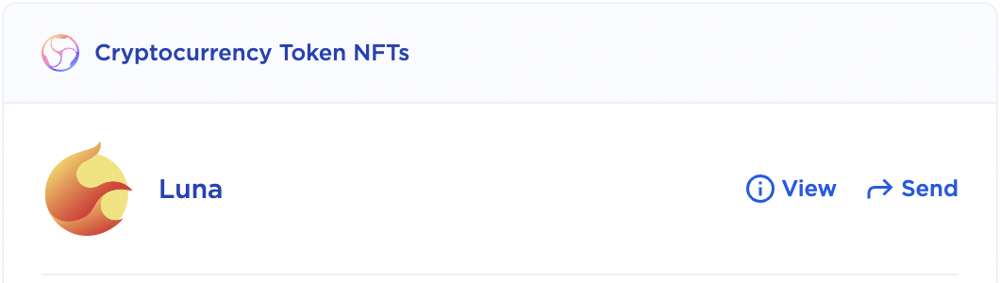

# Mint an NFT on Terra

NFTs have been generating a lot of buzz in the blockchain community for some time now, particularly with their use in trading digital art. NFTs, or non-fungible tokens, are unique digital assets that may be showcased and bought/sold on the blockchain. Purchasing an NFT gives you ownership over the unique digital creation, somewhat similar to buying a distinct painting or art piece.

In this tutorial, we will go over how you may mint your own NFT. Transfering your NFT to the Terra blockchain allows for exposure to millions of users who utilize the Terra ecosystem worldwide.

If you would like to view available collections that are on sale on the Terra blockchain, you may navigate to [randomearth marketplace](https://randomearth.io/collections).

## Getting Started

These instructions assume that you have already set up a Terra Station wallet in order to interact with the Terra blockchain. You may create a new wallet on the [Terra Station extension](https://docs.terra.money/docs/learn/terra-station/download/terra-station-extension.html) on Google Chrome which you will need to install in order to confirm transactions on the application.

You will also need to install [LocalTerra](https://github.com/terra-money/LocalTerra), a Terra blockchain and ecosystem which runs on your personal computer for testing, and [Terrain](https://github.com/terra-money/terrain), a Terra development environment for smart contract development. Be sure to follow the instructions to install all necessary dependencies for both LocalTerra as well as Terrain and ensure that they execute properly on your system.

After installing the above dependencies, you may clone the repository, which contains the smart contract with NFT minting functionality as well as the corresponding front-end application, to the directory of your choice utilizing the following command:

```
git clone https://github.com/terran6/nft-on-terra.git
```

Change directory into the cloned repository and run the command `npm install` in your terminal to install all relevant Node dependencies. If you have not installed npm (Node Package Manager) on your computer, you may find instructions on how to do so based on your operating system [here](https://kinsta.com/blog/how-to-install-node-js/).
<br/>

## Wallet Setup

There are a few changes you have to make before you may deploy your smart contract and create your first NFT. To test your smart contract functionality, you will be utilizing the preconfigured testing wallet `test1`. This wallet will be available on any Terra Station generated wallet. In order to view your test1 wallet, you may navigate to LocalTerra on your Terra Station extension on Google Chrome and switch your wallet to the preconfigured testing wallet.
<br/>

### Change Network to LocalTerra

Open the Terra Station extension on your Google Chrome web browser. Click on the settings icon in the upper right-hand corner and select the **localterra** network.

<div align="center">
  
</div>

### Switch to Test Wallet

Next, you will click on _Switch wallet_, then click on the drop down menu that appears in the subsequent popup and finally select the test1 wallet from the drop down list that appears.

<div align="center">
  
  
</div>

Now that you have successfully switched to the testing wallet on LocalTerra, you have setup your environment to be able to deploy your smart contract.
<br/>

## Contract Setup & Deployment

### Updating the Instantiate Message

Before you may deploy your contract and begin minting your NFT, you must make a change to the `config.terrain.json` file in the repository. Open this file and find the instantiate message section below.

```json
"instantiateMsg": {
  "name":"NFT Collection Name",
  "symbol":"NFTSYMBOL",
  "minter":"terraxxxxxxxxxxxxxxxxxxxxxxxxxxxxxxxxxxxxxxx"
}
```

You must first update the desired _name_ and _symbol_ that will correspond to your minted NFT. Also, the _minter_ will have to be updated to your test1 wallet address. This may be copied directly from your Terra Station extension.

<div align="center">
  
</div>

In this tutorial, we will be minting an NFT of Luna, the native token of Terraform Labs, to our Cryptocurrency Token NFTs collection. Therefore, we will update the parameters in the instantiate message to the following:

```json
"instantiateMsg": {
  "name":"Cryptocurrency Token NFTs",
  "symbol":"TOKENS",
  "minter":"terra111111111111111111111111111111111111111"
}
```

### Deploy Contract to LocalTerra

Now, you are finally ready to deploy your contract and run the NFT minting application. First, ensure you are running LocalTerra in a tab on your terminal. If you need to view instructions on how to get LocalTerra up and running, please refer to the [LocalTerra documentation](https://github.com/terra-money/LocalTerra).

Once LocalTerra is up and running, run the following command in another tab of your terminal in order to deploy the contract with your test1 wallet as the owner.

```
terrain deploy cw721-metadata-onchain --signer test1
```

### Mint an NFT!

Once the contract deployment is successfully completed, you may change into the `frontend` directory. From here, you must run `npm install` to install all necessary Node dependencies. Finally, you may run the command `npm start` to start up the NFT minting application.

<div align="center">
  
</div>

As shown above, you may fill out all of the necessary information on the form to mint your first NFT. ID may be any value that you would like to correspond to the ID of the new NFT. The Owner Address is the wallet address which will be the owner of the newly minted NFT (our test1 wallet address in this case). You may then enter a name for the NFT as well as input its corresponding URL.

<sub>**NFT URL Note**: _In general, many prefer to host their NFTs on IPFS (Interplanetary File System). You may use a variety of resources in order to post an NFT on IPFS. One service that you may utilize is [Pinata](https://www.pinata.cloud/). In this example, I have used an image available at [terra.money](https://www.terra.money/)._</sub>

Now, you are ready to mint your NFT! Click on the _Mint NFT_ button which will make your Terra Station extension pop up to request confirmation of the transaction. Click on the _Post_ button from your Terra Station extension and you will be presented with information on your newly minted NFT!

<div align="center">
  
</div>

## View Your New NFT

Now that you have minted your NFT, you may interact with it via the [NFT webpage](https://station.terra.money/nft) on the Terra Station website. If your wallet is not already connected, make sure to click on the `Connect` button in the upper right-hand corner of the screen and select your Terra Station Wallet.

<div align="center">
  
</div>

Next, click on `Add tokens >` and you will be presented with a pop-up box with a search bar. In this search bar, you will be pasting in your contract address. This can be found in the repository in the `refs.terrain.json` file next to the **default** key.

```json
{
  "localterra": {
    "cw721-metadata-onchain": {
      "codeId": "1",
      "contractAddresses": {
        "default": "terra222222222222222222222222222222222222222"
      }
    }
  }
}
```

Copy this address, paste it into the search bar and click on the `+` button located next to the name of your NFT collection.

<div align="center">
  
</div>

Now, you may close out this window and you will be presented with information on your NFT collection.

<div align="center">
  
</div>

As shown in the image above, we have our NFT presented in our Cryptocurrency Token NFTs collection. From here, we may `View` relevant information about our NFT as well as `Send` our NFT to any specified wallet address. You may utilize the application to mint even more NFTs for your collection as desired and interact with them on this webpage.

## Congratulations!

You have now minted your first NFT on the Terra blockchain! If you have your own unique digital creation that you would like to share with the world and are comfortable with the steps to mint an NFT on Terra, you may follow these instructions utilizing the `mainnet` network on your personal Terra Station wallet.

<sub>**NOTE**: _LocalTerra is not needed for deployments on mainnet and is only utilized for local testing and development purposes._</sub>
