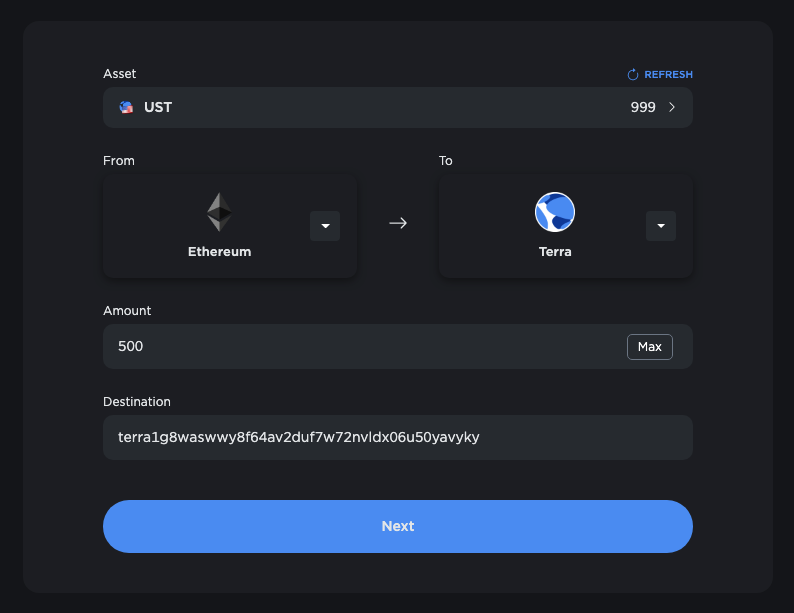
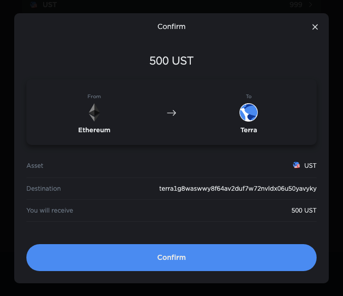
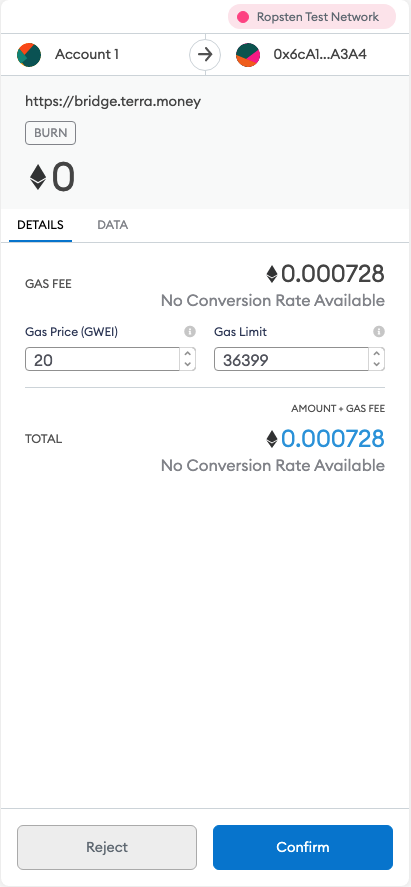
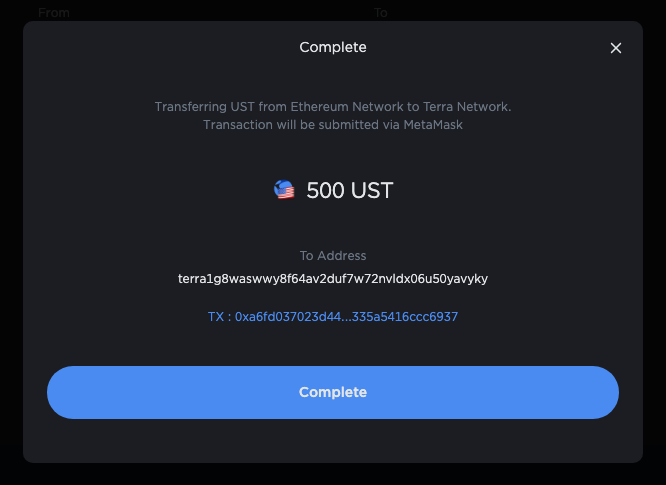
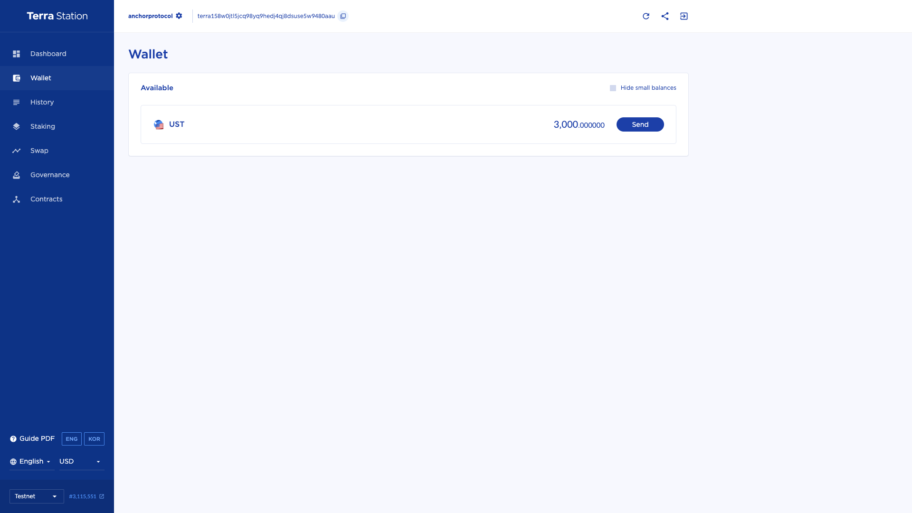
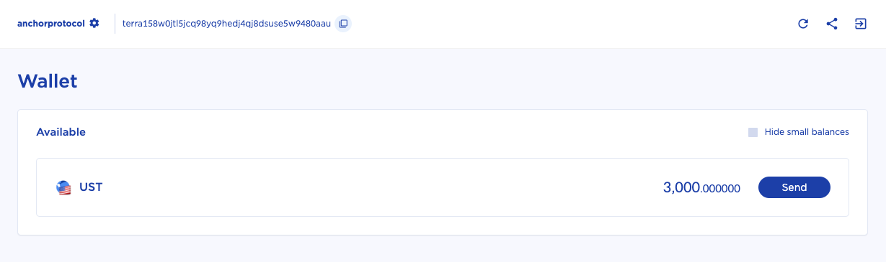
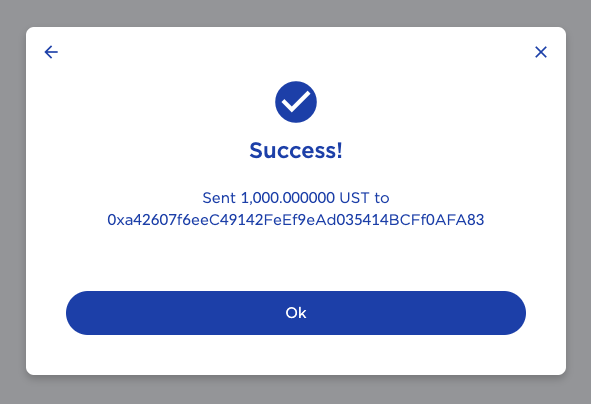

# Interchain Transfers

::: {warning}
This page is only for token transfers via [Shuttle](https://github.com/terra-money/shuttle) only. For token transfers with Wormhole, please refer to the [Wormhole WebApp](https://wormholebridge.com/#/transfer) and[ documentation](https://docs.wormholenetwork.com/wormhole/) for its usage.
:::

Native Terra tokens (TerraUSD, Luna) and ANC are interchain tokens -- they are available on the Terra blockchain and the Ethereum blockchain, also being available on the Binance Smart Chain (BSC) in the case for Native Terra tokens.

Interchain transfers between different chains are facilitated by the [Shuttle](https://github.com/terra-project/shuttle) bridge. Tokens transferred to blockchains other than Terra follow the most widely adopted standard on the chain (e.g. ERC20 for Ethereum) and are backed 1:1 with its counterparts on the Terra blockchain.

## Token Contract Addresses

### Luna

| Network  | Token Denom / Contract Address                                                                                        |
| -------- | --------------------------------------------------------------------------------------------------------------------- |
| Terra    | `uluna`                                                                                                               |
| Ethereum | [0xd2877702675e6cEb975b4A1dFf9fb7BAF4C91ea9](https://etherscan.io/address/0xd2877702675e6cEb975b4A1dFf9fb7BAF4C91ea9) |
| BSC      | [0xECCF35F941Ab67FfcAA9A1265C2fF88865caA005](https://bscscan.com/address/0xECCF35F941Ab67FfcAA9A1265C2fF88865caA005)  |

### Terra USD

| Network  | Token Denom / Contract Address                                                                                        |
| -------- | --------------------------------------------------------------------------------------------------------------------- |
| Terra    | `uusd`                                                                                                                |
| Ethereum | [0xa47c8bf37f92aBed4A126BDA807A7b7498661acD](https://etherscan.io/address/0xa47c8bf37f92aBed4A126BDA807A7b7498661acD) |
| BSC      | [0x23396cF899Ca06c4472205fC903bDB4de249D6fC](https://bscscan.com/address/0x23396cF899Ca06c4472205fC903bDB4de249D6fC)  |

### Anchor Token (ANC)

| Network  | Token Contract Address                                                                                                                     |
| -------- | ------------------------------------------------------------------------------------------------------------------------------------------ |
| Terra    | [terra14z56l0fp2lsf86zy3hty2z47ezkhnthtr9yq76](https://finder.terra.money/columbus-4/address/terra14z56l0fp2lsf86zy3hty2z47ezkhnthtr9yq76) |
| Ethereum | [0x0F3ADC247E91c3c50bC08721355A41037E89Bc20](https://etherscan.io/address/0x0F3ADC247E91c3c50bC08721355A41037E89Bc20)                      |

## User Interfaces / Usage

Terra Bridge and Terra Station are two major interfaces that allow users to easily perform interchain transfers. A guide for transferring tokens from a source chain (where tokens are sent from) to a destination chain (where tokens are sent to) is provided below.

### Terra Bridge

**Terra Bridge** is a web interface created specifically for interchain transfers. When a interchain transfer is requested, Terra Bridge will generate a transaction in the appropriate format that encodes the necessary data required for the transfer.

#### 1. Connect Terra Bridge With A User-Owned Account

In order to sign transactions created through Terra Bridge, users must have the relevant software installed for connecting the Terra Bridge WebApp with the user-owned account on the source chain. This can be achieved via wallet extensions or services that enable wallet-to-application connections.

&#x20;Supported wallet extensions / services and their installation links are:

| Network  | Extension                                                                                                                                                                                                                      |
| -------- | ------------------------------------------------------------------------------------------------------------------------------------------------------------------------------------------------------------------------------ |
| Terra    | [Terra Station Extension](https://chrome.google.com/webstore/detail/terra-station/aiifbnbfobpmeekipheeijimdpnlpgpp?hl=en)                                                                                                      |
| Ethereum | [Metamask](https://chrome.google.com/webstore/detail/metamask/nkbihfbeogaeaoehlefnkodbefgpgknn), [WalletConnect](https://walletconnect.org), [Coinbase Wallet](https://wallet.coinbase.com)                                    |
| BSC      | [Binance Chain Wallet](https://chrome.google.com/webstore/detail/binance-chain-wallet/fhbohimaelbohpjbbldcngcnapndodjp?hl=en), [Metamask](https://chrome.google.com/webstore/detail/metamask/nkbihfbeogaeaoehlefnkodbefgpgknn) |

#### 2. Specify Transfer Details

Before making the transfer, the details of the transfer should be specified by the user. The transfer details include:

* **Asset**: the asset type to transfer.
* **From**: source chain to make transfer from. Users must have an asset balance on this chain.
* **To**: destination chain to receive transfer.
* **Amount**: asset amount to transfer.
* **Destination**: account address to receive transferred tokens.

#### 3. Confirm Transfer Details

Confirm transfer details displayed on the WebApp and select **\[Confirm]** to proceed.

::: {warning}
Shuttle applies a fee of **0.1%** (with a minimum 1 UST fee) for Terra to Ethereum transfers. Transfer requests below a transfer value of 1 UST are ignored.
:::

#### 4. Sign and Broadcast the Transaction

Confirm transaction details and click **\[Confirm]** to sign and broadcast a transaction that encodes the interchain transfer request. Note that this request may be made from a different extension / service depending on the selected source blockchain.

#### 5. Transfer Request Complete

A popup will show to display the details of the interchain transfer.

::: {note}
The Shuttle bridge waits for sufficient blockchain confirmations to occur on the source chain before making the transfer. It may take up to a few minutes for transferred token to be reflected on the destination chain.
:::

### Terra Station

Interchain transfers from Terra to Ethereum / BSC are also supported on **Terra Station**. Interchain token transfers through Terra Station can be achieved by following the below steps.

#### 1. Select an Asset to Transfer

Select an asset to transfer and click **\[Send]**.

#### 2. Specify Transfer Details

Users should specify the transfer details listed below:

* **Network**: destination chain to receive transfer.
* **Send to**: account address to receive transferred tokens.
* **Amount**: asset amount to transfer.

Click **\[Next]** after all details have been filled.

#### 3. Confirm Transfer Details

Confirm transaction details, fill in the password and click **\[Send]** to sign and broadcast a transaction that encodes the interchain transfer request.

::: {warning}
Shuttle applies a fee of **0.1%** (with a minimum 1 UST fee) for Terra to Ethereum transfers. Transfer requests below a transfer value of 1 UST are ignored.
:::

#### 4. Transfer Request Complete

A popup will show to display the details of the interchain transfer.

::: {note}
The Shuttle bridge waits for sufficient blockchain confirmations to occur on the source chain before making the transfer. It may take up to a few minutes for transferred token to be reflected on the destination chain.
:::
