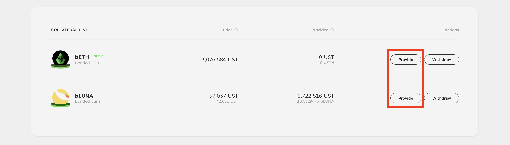
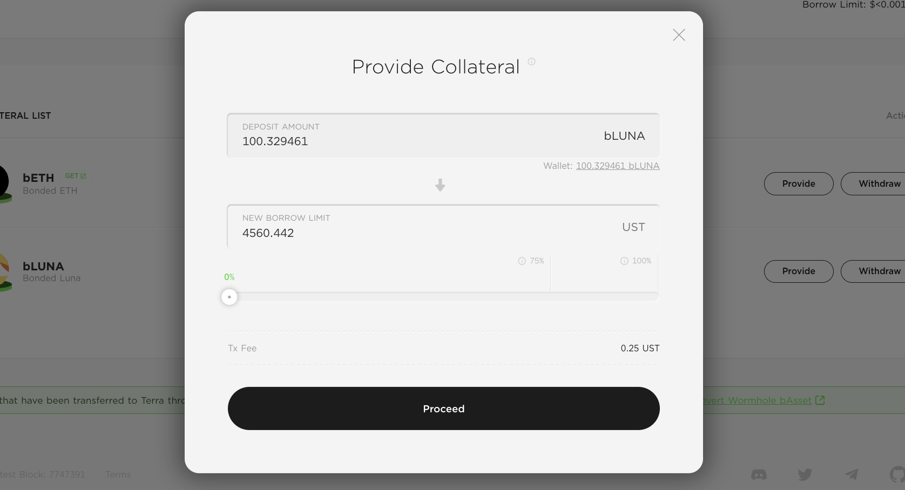
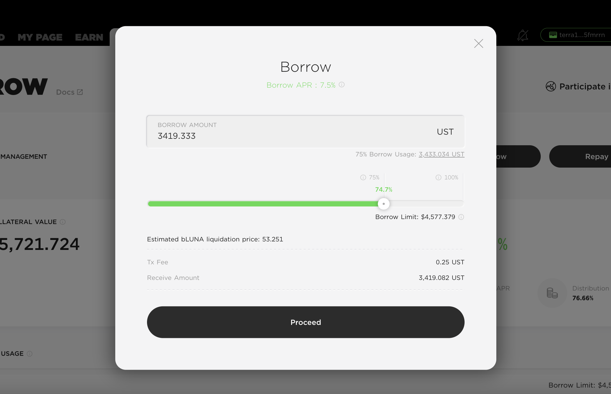
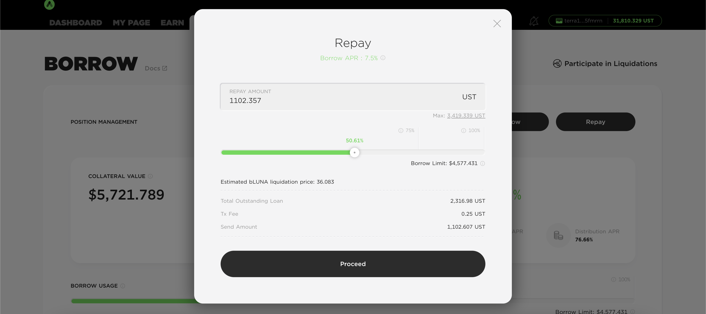
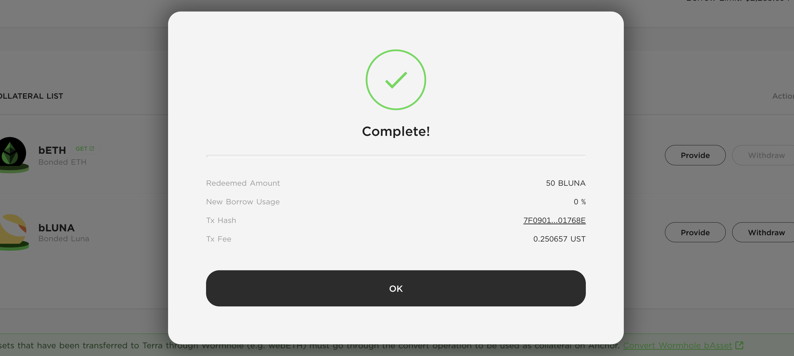

# BORROW

The **BORROW** page can be used to borrow Terra stablecoins from Anchor. The protocol requires users to provide bAsset tokens as collateral before making a loan. To create bAssets from your staking tokens, see  the [BOND page guide](./bond.md).&#x20;

Borrows can be made until the loan's borrowing usage reaches the borrowing limit, calculated based on collateral types, their prices, and deposit amount. Loans with a borrowing usage higher than the borrowing limit can be liquidated, and thus it is important for borrowers to closely maintain their borrowing usage as changes in collateral prices may occur.

::: {note}
As of March 17th, 2021, Anchor only supports Terra USD as the base currency.
:::

The **BORROW** page displays:

* **Collateral Value**: Total USD-denominated value of all collaterals provided by user.

* **Borrowed Value**: Total USD-denominated value of Terra stablecoins borrowed by user.
  *   **Borrowed**: Total amount of Terra stablecoins borrowed by user.

* **Net APY**: Net annualized percentage yield (APY) on borrows from both Borrow APR and Distribution APY
  * **Borrow APR**: Current annualized percentage rate (APR) of borrow interest.
  * **Distribution APY**: Current APY of ANC distribution to borrowers.

* **Loan Position Graph**: Displays the [risk ratio](../../protocol/loan-liquidation.md#collateral-liquidation) of user's loan position.
  * **Borrow Limit**: Maximum USD value borrowable by user based on provided collaterals.
  * **Borrowed Value / Borrow Limit Ratio**: Ratio value that signals user loan position's liquidation riskiness. Calculated by dividing user's borrowed value with their borrow limit.

## Providing bAsset collateral

::: {note}
Users should first obtain bAsset tokens in order to utilize them as loan collateral. bAsset minting can be done at the [**BOND**](bond.md) page in Anchor WebApp.
:::

1\. Navigate to the **BORROW** page.

.png)

2\. Decide a bAsset collateral to deposit and click **\[Provide]**.

3\. Enter the amount of collateral to provide. If the user already has a loan position, the provide amount can also be specified by selecting the loan's target borrow usage ratio via the slider bar. Click the **\[Proceed]** button to confirm.

4\. Station Extension should prompt you to sign a transaction that contains the collateral provide operation. Confirm the details presented and enter your password to sign.

5\. Collateral provide complete.

## Borrowing Terra stablecoins

1\. Navigate to the **BORROW** page.

.png)

2\. Click **\[Borrow]**.

3\. Enter the amount of stablecoins to borrow. The borrow can also be specified by selecting the loan's borrow usage via the slider bar, up until the borrow limit. Click the **\[Proceed]** button to confirm.&#x20;

4\. Station Extension should prompt you to sign a transaction that contains the borrow operation. Confirm the details presented and enter your password to sign.

5\. Borrow complete.

## Repaying borrowed Terra stablecoins

1\. Navigate to the **BORROW** page.

.png)

2\. Click **\[Repay]**.

3\. Enter the amount of stablecoins to repay. The repay amount can also be specified by selecting the loan's borrow usage ratio via the slider bar, up until the current borrow usage amount. Click the **\[Proceed]** button to confirm.

4\. Station Extension should prompt you to sign a transaction that contains the repay operation. Confirm the details presented and enter your password to sign.

5\. Repay complete.

## Withdrawing bAsset collateral

::: {note}
Withdrawn bAsset collaterals can be redeemed for their underlying assets at the Anchor WebApp's [**BOND**](bond.md) page.
:::

1\. Navigate to the **BORROW** page.

2\. Decide a bAsset collateral to withdraw and click **\[Withdraw]**.

3\. Enter the amount of collateral to withdraw. The withdraw amount can also be specified by selecting the loan's borrow usage ratio via the slider bar. Click the **\[Proceed]** button to confirm.

4\. Station Extension should prompt you to sign a transaction that contains the collateral withdraw operation. Confirm the details presented and enter your password to sign.

5\. Collateral withdraw complete.

